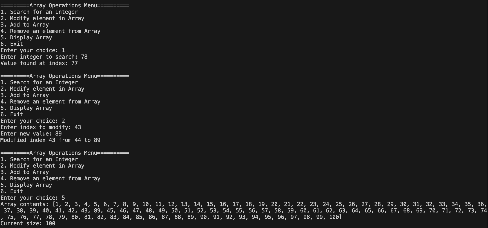
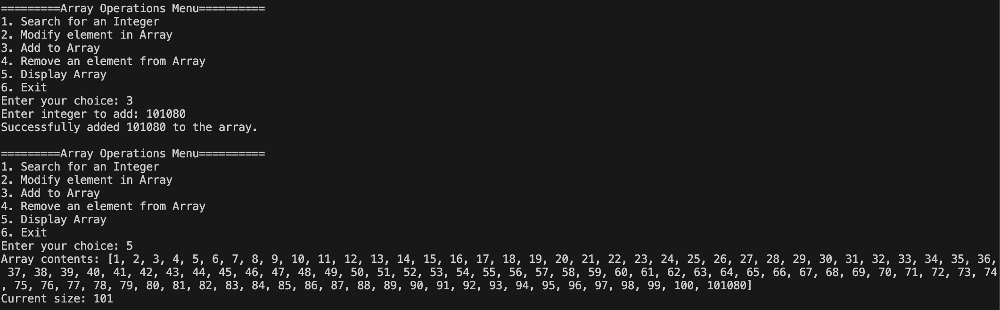

Program Design

Dynamic Size Tracking: Uses separate size and capacity variables to manage array growth
Standard Array: Uses int[] instead of ArrayList
Exception Handling: Throws specific exceptions 
Menu: Has and innteractive menu system to be able to test 

Testing Checklist
 Read data from file into standard array
 Search function returns correct index
 Modify function changes values and returns old/new values
 Add function appends to array
 Remove function deletes and shifts elements
 Exception handling for modify function
 Exception handling for add function
 Proper error messages displayed

